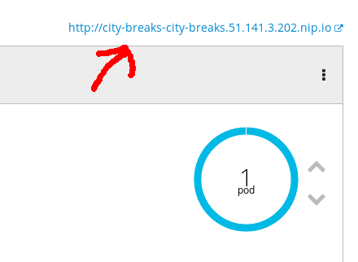
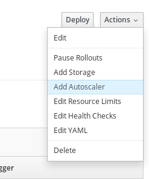
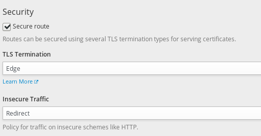
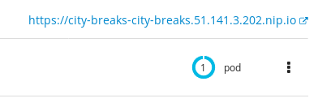

:toc:

= LAB Guide: City Breaks

[NOTE]
This lab guide is intended for learning the project, and running though things on your own. If you already know this project, and are showing other people, you might want to use the link:DEMO.adoc[demo guide] :-)

== The first service: public-shopping-website

=== Developer: I want to quickly deploy an existing .NET app into a container

In OpenShift Container Platform, you need to select *.NET Core* from the
service catalog. If you are running OpenShift Origin, you can import
this image builder into your service catalog by running `oc create -f ...`
against these files;
https://github.com/openshift/openshift-ansible/tree/master/roles/openshift_examples/files/examples/v3.7/image-streams

image:screenshots/dotnetcorebuilder.png[image]

This should spawn the deployment wizard, click "Next >";

image:screenshots/dotnetDeploymentWizard1.png[image]

Complete the Wizard with the following details;

include::includes/projectSetup.adoc[]

[IMPORTANT]
The screenshot _above_ shows the OpenShift builder is
version 1.0, however, this builder has the option to use a compiler
which is different for .NET Core 1.0 or .NET Core 2.0 projects. The
version you are selecting in the screenshot _below_ is the *compiler
version*, and this is a .NET Core 2.0 project. Therefore it is very
important to select version 2 builder. If you use select version 1 here
by accident then it will expect a .NET Core 1.0 project.json files and
similar that have been deprecated and the build would fail!

* *Application Name:* `city-breaks`
* *Git Repository:* `https://github.com/city-breaks-on-openshift/public-shopping-website.git`

image:screenshots/dotnetDeploymentWizard2.png[image]

Once the project has been created, it should see a build start in the
project overview. The build will take a couple of minutes;

image:screenshots/appOverview.png[image]

**Source 2 Image Build Process**

. Get source code from GitHub
. Determine that this is .NET source code
. Builds the code into a binary (.exe)
. Puts that .exe and dependencies into a container.
. Publishes that container into the local OpenShift Container Registry

=== Developer: I want to see that the app I deployed is working

Once the application has deployed, it should look like this;

OpenShift will automatically create a "route" so that you can access this application from outside OpenShift. Click on the link above the pod to open the app.

You should have an app that looks like this;

image:screenshots/app.png[image]

=== Developer: I now want to test a feature branch for multivariate testing or A/B deployments 

* *Time to complete:* 5 minutes
* *Why is this cool?:* Feature branches are commonly used by developers
to develop new features that have not yet been integrated into the main
application. Product Managers might typically want to deploy a feature
branch to see how users accept this feature, to test it works as
expected, and gradually introduce it as users respond positively.

* Use the .NET Core Builder Image to deploy (the master branch) as
normal. This must be built with a v2.0 builder.

image:screenshots/dotnetBuilder.png[image]

* Add to the project again, with a .NET Core Builder Image. This time,
use an *advanced options* to and specify the *feature_weather* branch.

image:screenshots/advOptions.png[image]

image:screenshots/gitReference.png[image]

* Dot _not_ deploy a new route.

image:screenshots/noRoute.png[image]

* You should have something that looks like this;

image:screenshots/overview.png[image]

* Now go find the route, and edit it. You want to "Split traffic across
multiple services" and select the new feature branch.

image:screenshots/splitRoute.png[image]

Once saved, it should look something like this;

image:screenshots/splitRouteOverview.png[image]

* Now go view the application.

Press Ctrl + F5 to refresh the page. Half of the time, you'll get
weather icons, half of the time, you'll not get weather icons. Make sure
Cookies are disabled to disable session persistance.

image:screenshots/withWeather.png[image]

image:screenshots/withoutWeather.png[image]

=== Developer: I want to use feature toggles to enable experimental features 

* *Time to complete:* 5 minutes
* *Why is this cool?:* Showchasing how a modern application development
principle, "feature toggles", are simply and easily implemented with
containers.

This C# dotnet application will check for the environment
screenshotsiable SHOW_POPULATION as a means for enabling this feature in
responses to requests for city information. You should set this in the
DeploymentConfig, and watch OpenShift deploy a new version
automatically.

image:screenshots/editDcEnv.png[image]

Wait a moment while the application redeploys (necessary for environment
screenshotsiables to take effect).

You should see your city information pop up now with population numbers;

image:screenshots/addPopulation.png[image]

=== Operations: I need to scale a deployment because I think there will be more traffic

As an operations person, you might expect a lot of people to now start using this web application. You don't think that a single container can take all these requests, so you want to scale up the deployment that the developer has created. 

Click on the "up" button to scale the application to multiple conatiners/pods.

image::screenshots/scalePods.png[]

=== Operations: Scale automatically based on CPU load

Scaling manually to several pods is OK, when you expect load, but you can scale automatically based on several factors, including CPU load. Go to the Deployment Configuration for city-breaks, and add an auto-scaler.

Set the following:

* **Min pods**: 3
* **Max pods**: 5
* **CPU Request target**: 50%

=== Operations: I need to scale a deployment because I think there will be more traffic

* *Time to complete:* 3
* *Why is this cool?:* To show how scaling is so super easy!

You can scale the city-info project at any time, just using the up/down
scale buttons. This will not impact existing connected users negatively.

image:screenshots/scalePods.png[image]

When you view the dashboard, you will see the city-info is provided with
a pod hostname. When you scale the application however, you will
probably see get updates from a single pod.

This is because OpenShift sets a browser cookie, which sticks you onto
one pod by default. You can easily overcome this, block the OpenShift
cookie in your browser like so;

=== Operations: I want the application traffic to be encrypted

To secure the traffic of applications running on OpenShift, you can enable several types of TLS encryption. Routes are encrypted in OpenShift. 

Go and find the application route, and edit it.

You should see an option to "Secure Route", tick this; 

For this use case, we'll use "Edge" termination (the encryption is terminated on the OpenShift router), but other options to re-encrypt, or pass through to the application are available. 

We can also force insecure traffic to be redirected, let's enable this option too.

OpenShift will automatically use existing certificates for this configuration, which means you do not have to import you own certificate.

If you go back to the application overview, you should see that your application is now accessible over HTTPS;

=== Developer: I need to connect to a database

**Not yet complete**

* *Time to complete:* 5 minutes
* *Why is this cool?:* Showcases how microservice workloads absolutely
don't have to be stateless only, and how configuration is commonly
acheived with containers.

[cols=",,",options="header",]
|===============================================================
|Environment Vaiable |Example |Description
|DATABASE_USERNAME |SA |Your MsSQL Database Username
|DATABASE_PASSWORD |toomanysecrets |Your MsSQL Database Password
|===============================================================

The database schema can be found in /screenshots/databaseSchema.sql in
this Git repo.

The database name and the single table name are both hard-coded to
city-info.

image:screenshots/blockCookies1.png[image]

image:screenshots/blockCookies2.png[image]

