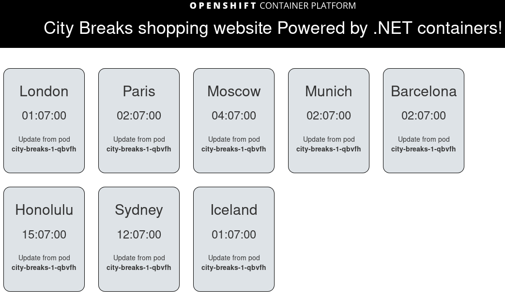

:toc:

= City Breaks 

= What is this?

City Beaks is a simple microservice application that simulates a holiday booking website (for
city breaks). This demonstrates
severeal features of OpenShift Container Platform with .NET and Azure.

== What do I need to deploy this microservices application?

* A working OpenShift environment, preferably on Azure! 

If you need help setting this up, see link:https://github.com/jamesread/single-node-openshift-azure-demo[single-node-openshift-azure-demo].

== Microsoft Azure and .NET features

This microservices application was designed to showcase general OpenShift, but also includes some Azure specific functionality, and is mostly built with .NET technologies.

This project will include the following Azure specific demos;

* Azure service broker [Available]
* Azure blob storage access from Containers (via picture-service) [Not yet available]
* Azure disks persistent volumes [Not yet available]
* Azure DevOps integration [Not yet available]
* Azure AI? [Not yet available]

link:roadmap/whiteboardRoadmap.png[Azure demo roadmap]

= Get started

== LAB Guide 

The link:LAB.adoc[LAB Guide] is intended for learning the project, running through things on your own.

== DEMO Guide

The link:DEMO.adoc[DEMO Guide] is intended for showing others OpenShift with .NET and Azure, useful for workshops, presentations, and speaking sessions.

